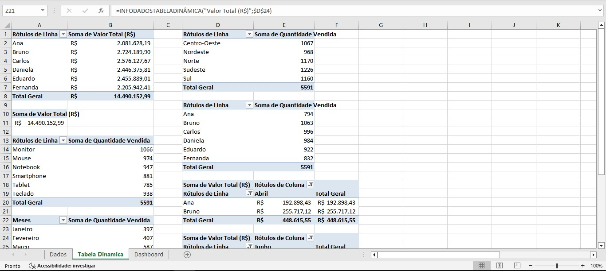
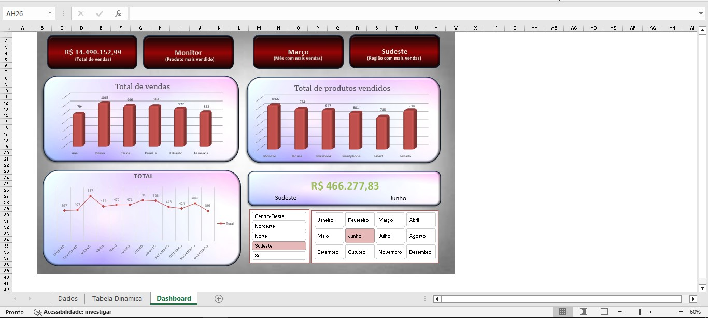

# 📊 Dashboard de Análise de Vendas com Excel

Este projeto consiste na construção de um dashboard interativo no Microsoft Excel, utilizando uma base simulada com mais de mil registros de vendas. O objetivo é demonstrar a aplicação de técnicas de modelagem, análise e visualização de dados diretamente na ferramenta, sem uso de complementos externos.

---

## 🎯 Objetivo do Projeto

- Consolidar uma base de dados em estrutura tabular
- Criar indicadores dinâmicos de desempenho (KPIs)
- Permitir análise interativa por filtros como mês, região, produto e vendedor
- Desenvolver visualizações responsivas e de fácil interpretação

---

## 🛠️ Recursos e Técnicas Utilizadas

- **Tabela Estruturada** como base de dados
- **Tabelas Dinâmicas** para agregação de informações
- **Slicers (Segmentações de Dados)** para filtros dinâmicos por Mês e Região
- **Fórmulas Avançadas:**
  - `SOMASES` – cálculo condicionado por múltiplos critérios
  - `TEXTO` – formatação de datas e valores
  - `CLASSIFICAR` – organização automática de dados
- **Gráficos de Colunas** para análise de volume por vendedor e produto
- **Cartões de Indicadores (KPI Cards)**:
  - Total de Vendas
  - Produto Mais Vendido
  - Mês com Maior Faturamento
  - Região com Maior Volume

---

## 📈 Visualizações Criadas

- Painel principal com KPIs e gráficos por vendedor/produto
- Segmentações interativas com atualização em tempo real
- Cartão de valor total que responde aos filtros aplicados

---

## 📦 Dados

- Dados fictícios gerados para simulação de vendas
- +1.000 linhas com colunas como: Data da Venda, Mês, Região, Produto, Vendedor, Quantidade, Valor Unitário e Valor Total

---

## 📸 Capturas de Tela

### Tabela Dinâmica

🧾

---

### Dashboard Interativo

📊

---

## 👨‍💻 Autor

**David Souza Ribeiro**  

---

## 📝 Observações

Este projeto faz parte de um portfólio pessoal com foco em análise de dados com Excel.  
Os dados são fictícios e foram gerados apenas para fins de estudo.
